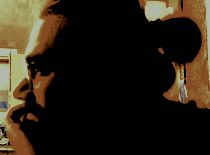

---
---

<link rel="stylesheet" href="styles.css" type="text/css">

I graduated from the [University of Bologna](https://unibo.it) with a MS in bioengineering in 2013. In 2013 I began working my PHD in Computer Science at [University of Camerino](https://computerscience.unicam.it) under the supervision of Prof.ssa [Emanuela Merelli](www.emanuelamerelli.eu)

My full CV is available [here](files/Zabor_CV_2017_Q4.pdf).

 

---